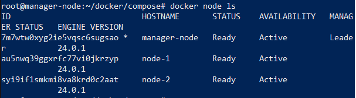
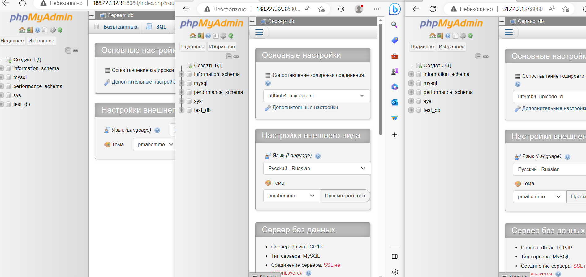

***Задание:***

Запустить MySQL и phpMyAdmin с помощью Docker compose file на трех виртуальных серверах - кластере, состоящем из одной  управляющей ноды, а оставшиеся две - управляемых с точки зрения безопасности.

***Решение***

Заходим на my.serverspace.ru - создаем три виртуальных сервера с Ubuntu и Docker (manager-node и дву worker node: node-1 и node-2).

Запускаем PowerShel, подключаемся по ssh к запущенным серверам.

В manager-node создаем директорию: mkdir compose.

Тереходим в данную директорию: cd compose.

Создаем файл: nano compose.yaml

    version: "3.7"    
    services:
    db:
        image: mysql
        restart: always
        environment:
        MYSQL_ROOT_PASSWORD: root
        MYSQL_DATABASE: test_db
        ports:
        - "3308:3306"
    phpmyadmin:
        image: phpmyadmin/phpmyadmin:latest
        restart: always
        environment:
        PMA_HOST: db
    # для входа в phpmyadmin
        PMA_USER: root
        PMA_PASSWORD: root
        ports:
        - "8080:80"

Тег ports используется для определения портов хоста и контейнера. Для службы db он сопоставляет порт 3308 на хосте с портом 3306 в контейнере MySQL. Для службы phpmyadmin он сопоставляет порт 8080 на хосте с портом 80 в контейнере phpMyAdmin.

Тег always используется для перезапуска, не нужно запускать контейнер каждый раз при перезагрузке компьютера вручную.

Для проверки запустим MySQL и phpMyAdmin на manager node в фоновом режиме:

    root@manager-node:~/docker/compose# docker-compose up -d

После того, как убедились, что сервис работает, останавливаем его: docker-compose stop.

На manager node инциализируем swarm:

    avc@avc-VirtualBox:~$ docker swarm init

Генерируется токен, открывается порт 2377. Копируем полученную команду <docker swarm join --token .............. >  и выполняем ее на всех узлах: node-1 и node-2.

Просматривае информацию о созданном кластере: 

    root@manager-node:~/docker/compose# docker node ls

Запускаем MySQL и phpMyAdmin на нашем кластере с помощью Docker-compose:

    docker stack deploy -c compose.yaml MYSQL

MYSQL - название нашего стека.

Сервисы, которые прописаны в compose файле запущены на нашем кластере.

В адресной строке браузера набираем ip-адреса наших серверов:

    ip_manager-node:8080
    ip_node-1:8080
    ip_node-2:8080

Проверяем работоспособность сервиса, на каждом из трех виртуальных серверов:

